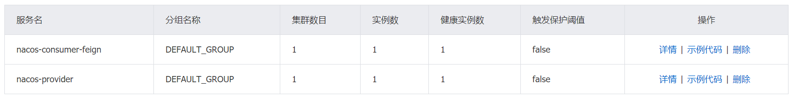

# Spring cloud alibaba 服务调用改造

目标：项目可以随便修改rpc调用方式

目前Spring cloud alibaba支持feign，dubbo。

1. 写一个starter
2. starter中的逻辑是，当配置文件中包含dubbo前缀的时候，扫描dubbo.scan.package指定的包，

## Nacos支持Feign

在Spring cloud alibaba项目中，可以使用Nacos作为注册中心，Feign作为服务调用方式。服务名为`spring.application.name`。

## BeanDefinitionRegistryPostProcessor

[BeanDefinitionRegistryPostProcessor解释](http://loveshisong.cn/%E7%BC%96%E7%A8%8B%E6%8A%80%E6%9C%AF/2016-11-22-Spring%E7%9A%84%E6%89%A9%E5%B1%95%E7%82%B9.html)

## ResourceLoaderAware

[ResourceLoaderAware解释](https://www.iteye.com/blog/jinnianshilongnian-1416321)

## DubboScanner

[DubboScanner解释](https://www.jianshu.com/p/d5ffdccc4f5d)

## BeanClassLoaderAware

[BeanClassLoaderAware解释](https://www.e-learn.cn/content/qita/1208272)

## 